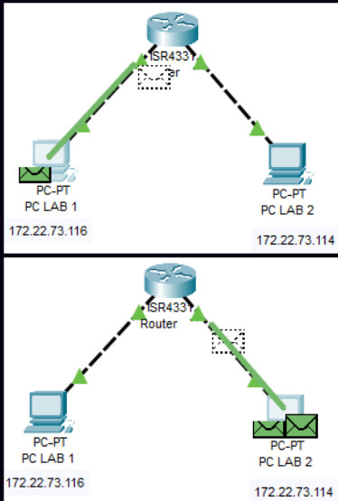

#  Análisis y Diagnóstico de Red con ICMP

##  Objetivo
El propósito de este laboratorio es emplear el protocolo **ICMP (Internet Control Message Protocol)** para el diagnóstico perimetral e interno de la red. A través de la captura de tráfico, analizaremos la estructura de los mensajes de control, evaluaremos el rastreo de rutas inter-nodos y simularemos escenarios de fallas de conectividad.

---

## 1. Topología del Laboratorio
Para las pruebas de diagnóstico, se utilizó una topología estructurada con dos estaciones de trabajo (PC1 y PC2) separadas por un enrutador (Gateway), simulando un entorno de múltiples redes lógicas.

---

## 2. Verificación de Conectividad Base (Ping)
Se inició el diagnóstico mediante la herramienta `ping` para medir la latencia y la tasa de pérdida de paquetes entre los nodos del laboratorio.

### Inspección Profunda (Deep Packet Inspection)
Para comprender el funcionamiento interno del comando, se analizó el flujo bidireccional en **Wireshark**. Se comprobó que el protocolo ICMP no utiliza puertos (al operar en la capa de Red), sino **Tipos (Types)** y **Códigos (Codes)**:
* **Type 8 (Echo Request):** Solicitud generada por el nodo origen.
* **Type 0 (Echo Reply):** Respuesta de confirmación generada por el nodo destino.

---

## 3. Rastreo de Rutas (Traceroute) y TTL
Para auditar los saltos (routers) por los que atraviesa un paquete IP hasta llegar a un destino en Internet, se utilizó el comando `tracert` (o `traceroute` en Linux) apuntando a un servidor externo (ej. `www.google.com`).

### ¿Cómo funciona el Traceroute a nivel de paquetes?
Al auditar este proceso con el sniffer, se comprobó la manipulación intencional del campo **TTL (Time To Live)** del encabezado IP:
1. El equipo envía un paquete ICMP con **TTL = 1**.
2. El primer router recibe el paquete, disminuye el TTL a 0, lo descarta y devuelve un error **ICMP Type 11 (Time-to-live exceeded)**, revelando así su dirección IP.
3. El equipo envía el siguiente paquete con **TTL = 2**, descubriendo el segundo router, y así sucesivamente hasta alcanzar el destino.

---

## 4. Análisis de Errores y Timeouts
Durante las pruebas de ruteo, se evaluaron anomalías en la comunicación:

### ⏱️ Timeouts (Asteriscos en Traceroute)
Al ejecutar el comando de rastreo, ocasionalmente se visualizaron asteriscos (`* * *`). Esto ocurre cuando un router intermedio rechaza responder con mensajes *ICMP Time Exceeded* por políticas de seguridad (Firewall), resultando en un tiempo de espera agotado para ese salto en particular.

### 🚫 Destination Unreachable (Type 3)
Se analizó teóricamente el comportamiento de la red ante fallas críticas, clasificando los tres escenarios principales donde un router o host emite un mensaje *Destination Unreachable*:
* **Network Unreachable:** El router no posee una ruta válida en su tabla de enrutamiento hacia la red de destino.
* **Host Unreachable:** El paquete llegó a la red de destino, pero el host final está apagado o no responde a las solicitudes ARP.
* **Port Unreachable:** El paquete alcanzó el equipo final, pero el servicio (puerto) al que intenta conectarse no está en escucha o está bloqueado por el firewall local.