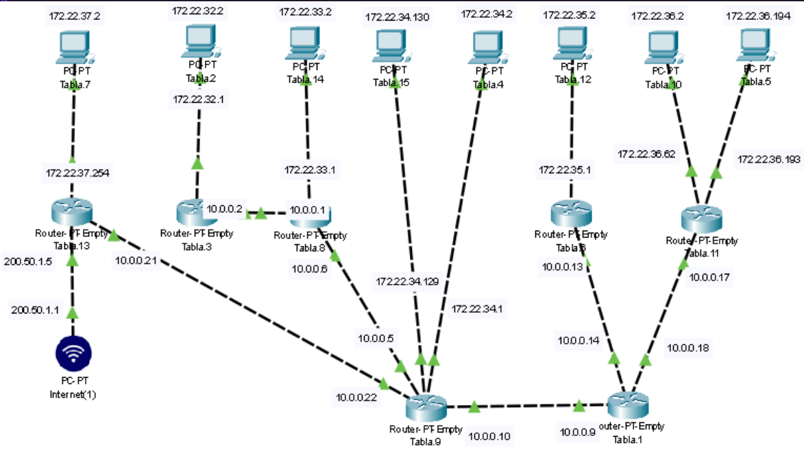

---

## 3. Implementación de Rutas Estáticas en IOS
Para interconectar las subredes internas, ingresamos al modo de configuración global de cada router y aplicamos el enrutamiento manual. 

La sintaxis utilizada para indicar a un router cómo alcanzar una red remota es:
`ip route [red_destino] [mascara_destino] [ip_siguiente_salto]`

> **💻 Ejemplo Práctico (Conectando sucursales):**
> Para que el router remoto (T9) pueda responderle a la red LAN 1 (`192.168.1.0/24`), se configuró la siguiente ruta estática apuntando a la IP de la interfaz WAN de su router vecino:

```bash
Router(config)# ip route 192.168.1.0 255.255.255.0 10.0.0.1
```

_(Este proceso se repitió sistemáticamente en cada nodo de la red para garantizar el enrutamiento bidireccional, evitando así el error de "Destination Unreachable")._

## 4. Configuración de Salida a Internet (Default Gateway)

En un entorno corporativo, es inviable conocer las direcciones de todos los servidores de Internet. Para solucionar esto, se implementa una **Ruta por Defecto** (o Ruta de Último Recurso).

Esta regla le indica al router: _"Si llega un paquete con un destino que no está en tu tabla de enrutamiento, envíalo por este camino hacia el Proveedor de Servicios (ISP)"_.

> **💻 Comando de configuración del Default Gateway:**

Bash

```
# Red destino 0.0.0.0 con máscara 0.0.0.0 engloba cualquier IP de Internet
Router(config)# ip route 0.0.0.0 0.0.0.0 [IP_DEL_ROUTER_PROVEEDOR]
```

## 5. Auditoría y Verificación

Una vez aplicadas las políticas de enrutamiento, se valida la configuración leyendo la tabla activa del router.

> **💻 Comando utilizado:** `show ip route`

En la salida de este comando, las rutas aprendidas manualmente aparecen marcadas con la letra **`S`** (Static), mientras que la ruta de salida a Internet aparece como **`S*`** (Static Candidate Default). La conectividad end-to-end se verificó exitosamente mediante tráfico ICMP (ping) entre las computadoras de los extremos opuestos de la topología.


# 🗺️ Enrutamiento Estático: Análisis y Resolución de Topologías Complejas

## 🎯 Objetivo de la Práctica

El propósito de este laboratorio es comprender la lógica de reenvío de paquetes (forwarding) en la Capa 3. Para ello, nos centraremos en una topología de red a gran escala, construyendo sus Tablas de Enrutamiento e implementando rutas estáticas para lograr conectividad total.

---

## 1. Topología del Laboratorio

Para este desafío se analizó una infraestructura amplia con múltiples routers interconectados, donde cada nodo administra subredes específicas. La complejidad de este escenario radica en la cantidad de saltos necesarios para comunicar los equipos que se encuentran en los extremos opuestos de la red.



---

## 2. Lógica de la Tabla de Enrutamiento

Antes de configurar los equipos en la consola, es fundamental planificar el tráfico de forma teórica. Un router solo conoce las redes que tiene directamente conectadas en sus interfaces. Para alcanzar destinos remotos, se estructuraron rutas que contienen tres elementos clave:

1. **Destino:** La red a la que queremos llegar.

2. **Genmask (Máscara):** El tamaño de esa red destino.

3. **Gateway (Siguiente Salto):** La dirección IP de la interfaz del router vecino por donde se debe enviar el paquete.


Tabla 1 (ROUTER 1)

| Destino   | Gateway  | Genmask         | Iface |
| --------- | -------- | --------------- | ----- |
| 0.0.0.0   | 10.0.0.9 | 0.0.0.0         | eth1  |
| 10.0.0.8  | 0.0.0.0  | 255.255.255.252 | eth1  |
| 10.0.0.16 | 0.0.0.0  | 255.255.255.252 | eth2  |
| 10.0.0.12 | 0.0.0.0  | 255.255.255.252 | eth0  |

Tabla 2 (PC 1)

| Destino     | Gateway     | Genmask       | Iface |
| ----------- | ----------- | ------------- | ----- |
| 0.0.0.0     | 172.22.32.1 | 0.0.0.0       | eth0  |
| 172.22.32.0 | 0.0.0.0     | 255.255.255.0 | eth0  |

Tabla 3 (ROUTER 2)

| Destino     | Gateway  | Genmask         | Iface |
| ----------- | -------- | --------------- | ----- |
| 0.0.0.0     | 10.0.0.2 | 0.0.0.0         | eth0  |
| 10.0.0.0    | 0.0.0.0  | 255.255.255.252 | eth01 |
| 172.22.32.0 | 0.0.0.0  | 255.255.255.0   | eth0  |

Tabla 4 (PC 2)

|             |             |                 |       |
| ----------- | ----------- | --------------- | ----- |
| Destino     | Gateway     | Genmask         | Iface |
| 0.0.0.0     | 172.22.34.1 | 0.0.0.0         | eth0  |
| 172.22.34.0 | 0.0.0.0     | 255.255.255.128 | eth0  |

  
  

Tabla 5 (PC 3)

|   |   |   |   |
|---|---|---|---|
|Destino|Gateway|Genmask|Iface|
|0.0.0.0|172.22.36.193|0.0.0.0|eth0|
|172.22.36.192|0.0.0.0|255.255.255.192|eth0|

  
  

Tabla 6 (ROUTER 3)

|   |   |   |   |
|---|---|---|---|
|Destino|Gateway|Genmask|Iface|
|0.0.0.0|10.0.0.13|0.0.0.0|eth1|
|10.0.0.12|0.0.0.0|255.255.255.252|eth1|
|172.22.35.0|0.0.0.0|255.255.255.0|eth0|

  
  

Tabla 7 (PC 4)

|   |   |   |   |
|---|---|---|---|
|Destino|Gateway|Genmask|Iface|
|0.0.0.0|172.22.37.254|0.0.0.0|eth0|
|172.22.37.0|0.0.0.0|255.255.255.0|eth0|

  
  

Tabla 8 (ROUTER 4)

|   |   |   |   |
|---|---|---|---|
|Destino|Gateway|Genmask|Iface|
|0.0.0.0|10.0.0.6|0.0.0.0|eth1|
|10.0.0.4|0.0.0.0|255.255.255.252|eth1|
|10.0.0.0|0.0.0.0|255.255.255.252|eth2|
|172.22.33.0|0.0.0.0|255.255.255.0|eth0|

  
  

Tabla 9 (ROUTER 5)

|   |   |   |   |
|---|---|---|---|
|Destino|Gateway|Genmask|Iface|
|0.0.0.0|10.0.0.22|0.0.0.0|eth2|
|10.0.0.4|0.0.0.0|255.255.255.252|eth1|
|10.0.0.20|0.0.0.0|255.255.255.252|eth2|
|10.0.0.8|0.0.0.0|255.255.255.252|eth3|
|172.22.34.0|0.0.0.0|255.255.255.128|eth0|
|172.22.34.128|0.0.0.0|255.255.255.128|eth4|

  
  

Tabla 10 (PC 5)

|   |   |   |   |
|---|---|---|---|
|Destino|Gateway|Genmask|Iface|
|0.0.0.0|172.22.36.62|0.0.0.0|eth0|
|172.22.36.0|0.0.0.0|255.255.255.192|eth0|

  
  

Tabla 11 (ROUTER 6)

|   |   |   |   |
|---|---|---|---|
|Destino|Gateway|Genmask|Iface|
|0.0.0.0|10.0.0.17|0.0.0.0|eth1|
|10.0.0.16|0.0.0.0|255.255.255.252|eth1|
|172.22.36.0|0.0.0.0|255.255.255.192|eth2|

  
  

Tabla 12 (PC 6)

|   |   |   |   |
|---|---|---|---|
|Destino|Gateway|Genmask|Iface|
|0.0.0.0|172.22.35.1|0.0.0.0|eth0|
|172.22.35.0|0.0.0.0|255.255.255.0|eth0|

  
  

Tabla 13 (ROUTER 7)

|   |   |   |   |
|---|---|---|---|
|Destino|Gateway|Genmask|Iface|
|0.0.0.0|200.52.1.5|0.0.0.0|eth1|
|200.52.1.0|0.0.0.0|255.255.255.192|eth1|
|172.22.37.0|0.0.0.0|255.255.255.0|eth2|
|10.0.0.20|0.0.0.0|255.255.255.252|eth0|

  
  

Tabla 14 (PC 7)

| Destino     | Gateway     | Genmask       | Iface |
| ----------- | ----------- | ------------- | ----- |
| 0.0.0.0     | 172.22.33.1 | 0.0.0.0       | eth0  |
| 172.22.33.0 | 0.0.0.0     | 255.255.255.0 | eth0  |

Tabla 15 (PC 8)

| Destino       | Gateway       | Genmask         | Iface |
| ------------- | ------------- | --------------- | ----- |
| 0.0.0.0       | 172.22.34.129 | 0.0.0.0         | eth0  |
| 172.22.34.128 | 0.0.0.0       | 255.255.255.128 | eth0  |

---

## 3. Implementación de Rutas Estáticas en IOS
Con la planificación lista, ingresamos al modo de configuración global de los routers para enseñarles los caminos hacia las redes remotas. 

La sintaxis utilizada en Cisco IOS es:
`ip route [red_destino] [mascara_destino] [ip_gateway]`

> **💻 Ejemplo de configuración:**
> Para que los paquetes puedan viajar entre las distintas LANs y no sean descartados en el camino, se aplicaron rutas estáticas apuntando a las interfaces de los routers vecinos (utilizando las IPs de los enlaces punto a punto, como las redes `10.0.0.X` o `172.22.X.X` documentadas en las tablas).

```bash
Router(config)# ip route 192.168.2.0 255.255.255.0 10.0.0.2
````

_(Este proceso se repitió sistemáticamente en cada nodo clave del Caso C para asegurar respuestas bidireccionales y evitar el error "Destination Unreachable")._

## 4. Configuración de Salida a Internet (Default Gateway)

Para que los equipos de esta gran topología tengan salida a Internet a través del router del proveedor, se implementó una **Ruta por Defecto** (o Ruta de Último Recurso).

Esta regla le indica al router: _"Si llega un paquete con un destino que no está en tu tabla local, envíalo por este camino"_.

> **💻 Comando de configuración:**

Bash

```
# La red destino 0.0.0.0 con máscara 0.0.0.0 engloba cualquier IP desconocida
Router(config)# ip route 0.0.0.0 0.0.0.0 [IP_DEL_ROUTER_PROVEEDOR]
```

## 5. Auditoría y Verificación

Tras configurar todos los saltos del Caso C, validamos que la información se haya guardado correctamente en la memoria de los equipos.

> **💻 Comando utilizado:** `show ip route`

En esta salida, las redes directamente conectadas figuran con la letra **`C`**, las rutas estáticas aprendidas manualmente con la letra **`S`**, y la ruta por defecto hacia internet con **`S*`**. Finalmente, se verificó la conectividad de extremo a extremo mediante `ping` entre las PCs más alejadas de la topología.