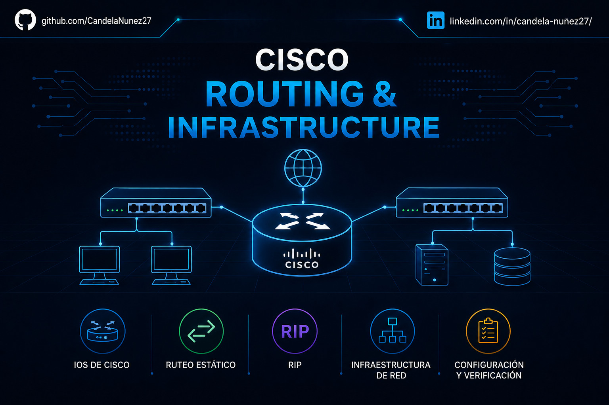

#  Laboratorio 02: Cisco Routing & Infrastructure

##  Descripción de la Sección

Este directorio documenta el diseño, configuración y administración de infraestructuras de red de Capa 3 (Red). Las prácticas aquí expuestas se centran en la operación de equipos Cisco (a través de su sistema operativo IOS) y la implementación de topologías lógicas para garantizar la interconectividad entre múltiples redes LAN y WAN.

El dominio del enrutamiento es esencial para cualquier administrador de infraestructura, permitiendo segmentar el tráfico, optimizar los caminos de datos y asegurar la disponibilidad del servicio ante fallos físicos en los enlaces.

## 🗂️ Índice de Prácticas

A continuación, se detallan los documentos técnicos de esta sección. Haz clic en cada enlace para revisar las topologías, los comandos ejecutados y las pruebas de conectividad:

* **[01 - Administracion Cisco IOS](01%20-%20Administracion%20Cisco%20IOS.md):** Exploración de la arquitectura interna de un router Cisco (RAM, ROM, Flash, NVRAM), navegación entre modos de ejecución (Usuario, Privilegiado, Configuración Global) y levantamiento inicial de interfaces GigabitEthernet.
* **[02 - Enrutamiento Estático y Tablas de Ruteo](02%20-%20Enrutamiento%20Estático%20y%20Tablas%20de%20Ruteo.md):** Análisis y construcción manual de Tablas de Ruteo. Configuración de rutas estáticas (`ip route`) y puertas de enlace predeterminadas (*Default Gateways*) para interconectar múltiples sucursales simuladas y proveer salida a Internet.
* **[03 - Enrutamiento Dinámico (RIP) y Alta Disponibilidad](03%20-%20Enrutamiento%20Dinámico%20(RIP)%20y%20Alta%20Disponibilidad.md):** Despliegue del protocolo de enrutamiento Vector-Distancia (RIP). Simulación de fallos físicos en una topología en anillo para auditar la convergencia automática de la red y el descubrimiento de rutas alternativas.

##  Herramientas Empleadas

* **Simulador de Red:** Cisco Packet Tracer.
* **Sistema Operativo:** Cisco IOS (Internetwork Operating System).
* **Protocolos y Conceptos:** IPv4, Tablas de Enrutamiento, RIPv2, ICMP (Ping de verificación end-to-end).