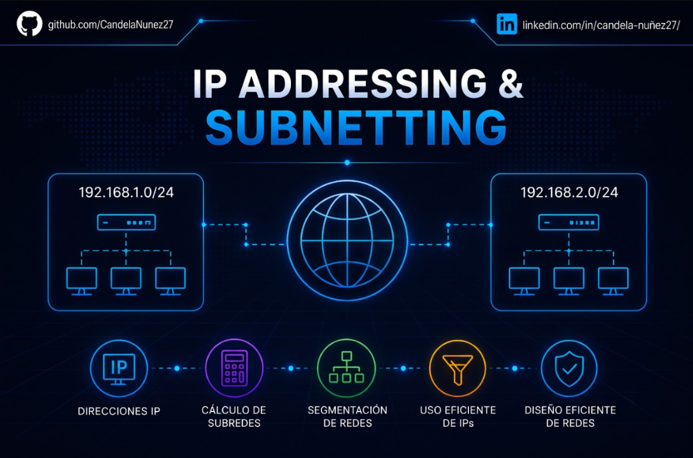

#  Laboratorio 03: IP Addressing & Subnetting

## Descripción de la Sección
Este directorio contiene la documentación técnica referida a la planificación lógica de redes (IPAM). Antes de configurar cualquier equipo físico o virtual, es imperativo establecer un diseño de direccionamiento IP sólido que optimice el rendimiento, limite los dominios de difusión (Broadcast Domains) y permita la escalabilidad futura.

Aquí se exponen ejercicios prácticos de cálculo de subredes (Subnetting) utilizando técnicas de enrutamiento sin clases (CIDR) y cálculos de longitud de máscara variable (VLSM).

## 🗂️ Índice de Prácticas

* **[01 - Subnetting Capacity Planning](01%20-%20Subnetting%20Capacity%20Planning.md):** Demostración de cálculos de direccionamiento lógico, determinación de rangos de hosts utilizables, identificación de direcciones de red/broadcast y uso de herramientas de consola para IPAM.

## Herramientas Empleadas
* **Cálculo de subredes:** Lógica binaria / Operaciones AND lógicas.
* **Herramientas Linux:** Utilidad `ipcalc` para auditoría y validación de bloques de red de forma automatizada desde la terminal.
* **Conceptos:** CIDR, VLSM, Dominios de Broadcast, Direccionamiento IPv4.
