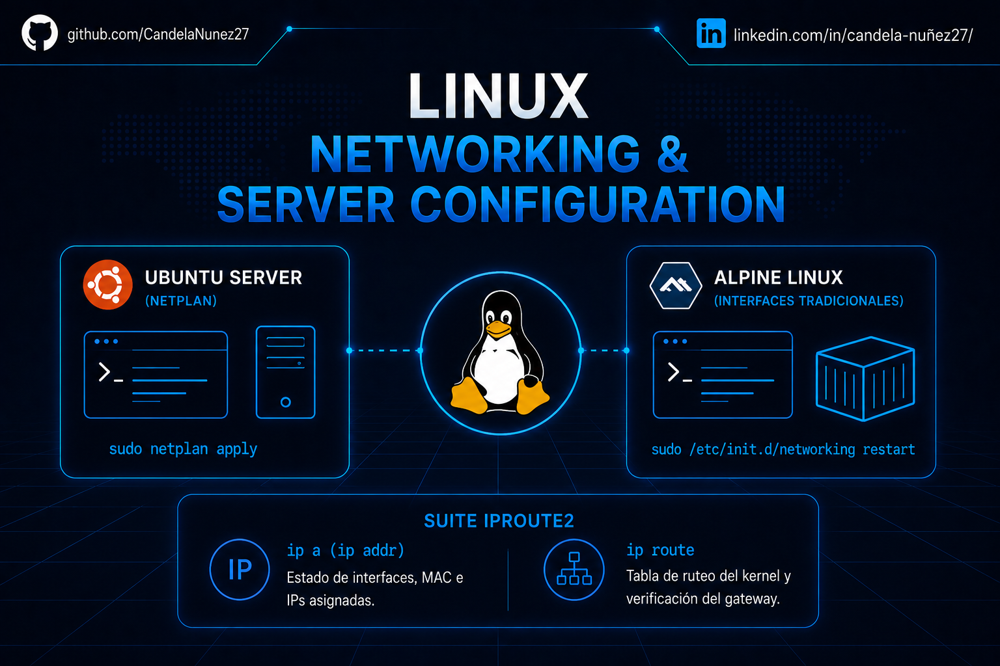

#  Laboratorio 04: Linux Networking & Server Configuration

##  Descripción de la Sección

Este directorio se enfoca en la administración de redes a nivel de Sistema Operativo. En entornos de centros de datos, servidores bare-metal y despliegues en la nube (Cloud), la configuración de la conectividad debe realizarse estrictamente a través de la interfaz de línea de comandos (CLI), sin depender de entornos gráficos.

Aquí se documentan los procedimientos estándar para aprovisionar servidores Linux con direccionamiento estático, resolución DNS y enrutamiento de red, abarcando tanto distribuciones corporativas líderes como sistemas minimalistas orientados a contenedores y microservicios.

## 🗂️ Índice de Prácticas

A continuación, se detalla la documentación técnica de esta sección:

* **[01 - Administracion Interfaces Linux](01%20-%20Administracion%20Interfaces%20Linux.md):** Despliegue de configuraciones de red utilizando el estándar moderno **Netplan** (mediante serialización YAML) en Ubuntu Server, y el método tradicional gestionando `/etc/network/interfaces` en Alpine Linux. Incluye el uso intensivo de la suite `iproute2` para el diagnóstico y auditoría de los enlaces lógicos.

## Herramientas Empleadas
* **Sistemas Operativos Operados:** Ubuntu Server, Alpine Linux.
* **Gestores y Controladores de Red:** Netplan (backend `systemd-networkd`), OpenRC.
* **Herramientas de Diagnóstico CLI:** Suite `iproute2` (`ip addr`, `ip route`, `ip link`, `ip neigh`).